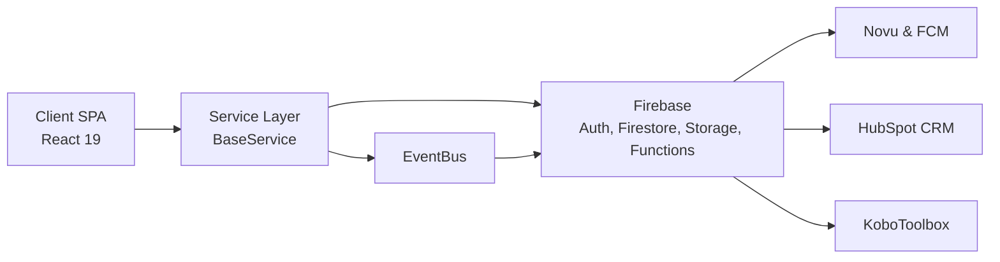

## System context

GrantMaster is a multi-tenant SaaS platform for NGOs to manage grants, projects, budgets, compliance, and reporting.

The system serves several primary stakeholders:

- **Admins** configure organizations, access control, and core settings.
- **Project Managers** manage grants, projects, activities, and budgets.
- **Auditors** review compliance, approvals, and system events.
- **Funders and external portals** integrate through dedicated funder-facing experiences and APIs.

All tenants share the same codebase and Firebase project, with strict logical isolation per organization enforced through multi-tenancy patterns.

<Callout kind="info">

This overview focuses on runtime architecture and core patterns. For deployment topologies, backups, and SLOs, read the deployment and disaster recovery documents linked below.

</Callout>

## High-level architecture

The platform follows a client-heavy architecture: a React single-page application communicates with a Firebase-backed backend and a small set of third-party integrations.

At a high level:

- The **React SPA** handles UI, state management, and navigation.
- A **Service Layer** (`BaseService` subclasses) encapsulates all data access and domain logic from the client.
- An in-memory **EventBus** coordinates domain events within the client and persists critical events.
- **Firebase** provides authentication, data storage, file storage, serverless functions, and analytics.
- **Integrations** connect to external systems like Novu (notifications), HubSpot, and KoboToolbox.

### High-level component diagram



This diagram shows the primary runtime flows: the SPA talks only to the service layer, which uses Firebase and emits events; Firebase Functions mediate most outbound calls to integrations.

## Client architecture

The frontend is a React 19 single-page application built with TypeScript and Vite.

Key characteristics:

- **Component library**: UI is composed with Tailwind CSS and shadcn/ui primitives.
- **Service Layer**: All reads and writes go through `BaseService`-derived classes, which handle typing, tenancy, and error translation.
- **Event-driven UI**: Components subscribe to the in-memory EventBus to react to domain events such as `GRANT_AWARDED` or `PROJECT_UPDATED` without tight coupling.
- **Form and validation**: Zod schemas keep UI forms and backend types aligned, reducing runtime surprises.

<Callout kind="alert">

Do not bypass the Service Layer to call Firestore or Firebase SDKs directly from components. You lose tenancy guarantees, type safety, and centralized error handling.

</Callout>

## Backend and data architecture

The backend relies heavily on Firebase services:

- **Firebase Auth** manages user identity and role-based access control (RBAC).
- **Cloud Firestore** stores all core domain data in a multi-tenant structure.
- **Cloud Storage** holds documents, attachments, and other binary assets.
- **Cloud Functions** implement server-side workflows, heavy processing, and integrations.
- **Analytics** track usage, funnels, and key metrics.

Multi-tenancy and security are enforced at multiple layers:

- **Collection design**: Root collections include an `organizationId` dimension so every document belongs to an organization.
- **Security Rules**: Firestore security rules ensure users only access documents for their `organizationId` and allowed roles.
- **BaseService**: All queries and writes inject and validate `organizationId` from the current `OrganizationContext` to prevent cross-tenant access in code.
- **OrganizationContext**: Frontend context keeps the active organization consistent across navigation and service calls.

Firestore access uses type-safe helpers from `src/core/firestoreCollections.ts` to keep collection names, document shapes, and converters centralized and reusable.

## Core patterns

Core architectural patterns keep the codebase consistent, debuggable, and safe across tenants.

### BaseService

`BaseService` is the foundation for all domain-specific services (for example, `GrantService`, `ProjectService`).

- **Type safety with Zod**: Each service defines Zod schemas for its entities and uses them to validate data coming from Firestore and before writes.
- **Tenancy enforcement**: Methods automatically inject and check `organizationId` based on the current `OrganizationContext`.
- **Auditability**: Writes can log audit trails and emit events to the EventBus or `systemEvents` collection.
- **Resilience**: Centralized error handling converts Firebase and network errors into domain-aware error objects.

### EventBus and domain events

The EventBus provides lightweight in-memory decoupling on the client.

- **Publish/subscribe model**: Components and services subscribe to domain events (`GRANT_AWARDED`, `BUDGET_UPDATED`) rather than calling each other directly.
- **UI decoupling**: A component that needs to refresh when a grant is awarded listens for the event instead of depending on the method that awarded the grant.
- **Persistence of critical events**: High-value events are also written to Firestore in a `systemEvents`-style collection for audits, notifications, and analytics.
- **Integration hooks**: Event handlers in Functions can react to persisted events and push notifications or sync to external systems.

### Multi-tenancy with organizationId

Multi-tenancy is a first-class concern:

- **Data modeling**: Every top-level collection stores documents with an `organizationId` field.
- **Query scoping**: Services always filter by `organizationId` from the current context; there are no cross-tenant queries.
- **Security**: Firestore Security Rules verify that reads and writes respect the caller's `organizationId` and role.
- **Testing**: Firebase emulators and automated tests include scenarios for multiple organizations to catch isolation regressions.

### Data layer helpers

The `src/core/firestoreCollections.ts` module defines type-safe bindings to Firestore:

- **Collection definitions**: Exposes typed helpers for core collections such as grants, projects, budgets, and system events.
- **Converters**: Uses Firestore converters and Zod validation to keep stored data in sync with domain models.
- **Centralization**: Any structural changes to collections flow from this module, keeping the rest of the codebase simpler.

## Technology stack

The table below summarizes the primary technologies used across the stack.

| Area              | Technology / Service                                            | Notes                                                             |
| ----------------- | --------------------------------------------------------------- | ----------------------------------------------------------------- |
| Frontend runtime  | React 19                                                        | Single-page application                                           |
| Language / build  | TypeScript, Vite                                                | Type-safe client, fast dev builds                                |
| UI layer          | Tailwind CSS, shadcn/ui                                        | Design system and UI primitives                                  |
| Validation        | Zod                                                             | Schemas shared across UI and services                            |
| Auth / RBAC       | Firebase Auth                                                   | Authentication and role-based access control                     |
| Database          | Cloud Firestore                                                 | Multi-tenant document database                                   |
| File storage      | Cloud Storage                                                   | Attachments and document uploads                                 |
| Server logic      | Cloud Functions for Firebase                                   | Integrations, workflows, and background processing               |
| Notifications     | Novu, Firebase Cloud Messaging (FCM)                            | In-app and push notifications                                    |
| Analytics         | Firebase Analytics                                              | Usage tracking and funnels                                       |
| Integrations      | HubSpot CRM, KoboToolbox                                       | CRM sync and monitoring & evaluation (M&E) data ingestion        |
| Testing           | Vitest, Playwright, Firebase Emulators                          | Unit, integration, and end-to-end tests                          |
| Monitoring        | Sentry                                                          | Error and performance monitoring                                 |
| Internal patterns | Custom `BaseService`, EventBus, Firestore helper modules       | Encapsulated domain logic, events, and typed collections         |

<Callout kind="info">

When introducing new dependencies, align them with these existing patterns: React services on the client, Firebase for backend primitives, and Functions as the primary integration boundary.

</Callout>

## Local development and tooling

Local development runs the React SPA against Firebase emulators so you can work safely with seeded data.

Use the following commands to start everything:

<CodeGroup tabs="Single terminal,Two terminals" show-lines={true}>

```bash
# Start emulators, seed data, and Vite dev server
npm run dev:all

# Same as above, but clear emulator data first
npm run dev:all:fresh
```

```bash
# Terminal 1: start emulators + seed
npm run dev:start

# Terminal 2: start the Vite dev server
npm run dev
```

</CodeGroup>

Default ports are: Vite 3000; Emulator UI 4000; Firestore 8080; Auth 9099; Storage 9199; Functions 5001. For full setup details and environment variables, read [Environment setup](/environment-setup).

## Next reads

Once you understand the high-level architecture, dive into the core concepts and operational docs that you will touch most often.

<Columns cols={2}>

<Card title="Glossary" href="/glossary" icon="book-open" cta="Learn the domain language">

Get clear definitions for grants, projects, budgets, workflows, and internal terminology before working on business logic.

</Card>

<Card title="Environment setup" href="/environment-setup" icon="terminal" cta="Set up your dev box">

Configure Node, Firebase CLI, emulators, and environment variables so you can run the app and tests locally.

</Card>

<Card title="Deployment and infrastructure" href="/deployment-and-infrastructure" icon="cloud" cta="See how we ship">

Review how we deploy the SPA and Firebase resources, including environments, pipelines, and configuration.

</Card>

<Card title="Disaster recovery" href="/disaster-recovery" icon="shield" cta="Understand failure modes">

Understand backup strategies, restore procedures, and how multi-tenancy impacts incident handling.

</Card>

</Columns>